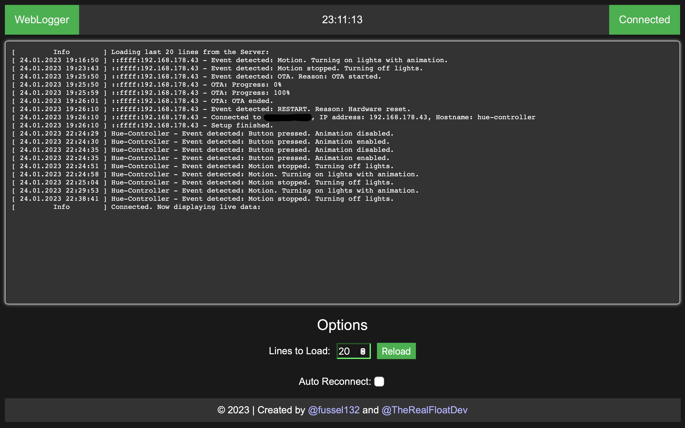

# WebLogger

<a href="https://github.com/fussel132/weblogger/actions"></a>

A simple web application to log data and view it.

## Screenshot (used with [hue-controller](https://github.com/fussel132/hue-controller))


## Installation

Node.js 16.x or above is required to run this application. To install the dependencies, run:

```bash
npm install
```
To serve the applicatoin, run:

```bash
npm run start
```
And you are ready to go! The application will be served at `http://localhost:3000`

## Usage

The Project can be split into two parts: The Frontend and the Backend.

### REST API (Backend)
The API only accepts JSON data, so make sure your content-type-header is set properly.

There are two different ways the API handles POSTed Data:
1. Your JSON object contains a 'msg' key. The value of this key will be logged.
2. Your JSON object does not contain a 'msg' key. The whole JSON object will be logged. (You can also implement your own logging function in the `api.js` file around line 120)
> To resolve hostnames, enter the IP address and the hostname you wish to be displayed in the `server/hostnames.json` file. (This is not required)

The `/api/log` endpoint can either be POSTed to or GETed from.
- POST JSON data to `/api/log` to log data.
  - Example cURL: `curl -X POST -H "Content-type: application/json" -d "{\"msg\":\"Log Message\"}" http://localhost:3000/api/log`
- GET JSON data from `/api/log` to get all logged data. (Needs `reason: fetchLog, lines: <number between 1-100>` to be set as headers)
  - Example cURL: `curl -X GET -H "reason: fetchLog" -H "lines: 10" http://localhost:3000/api/log`

### WebApp (Frontend)
- The WebApp is served at `http://localhost:3000/` (if the port was not changed).
- The WebApp can be used to view the logged data. If the log looks weird or whatever, try the relaod button!
- Connection might be dropped. Just click the reload button to reconnect. If auto reconnect is enabled, the browser will try to reconnect automatically each second till the connection is re-established.

## Known Issues
- Each request that is not being handled by a express middleware will result in the webserver sending the 404.html to the client. This is not intended as requests like GET /favicon.ico (if not present) should not be answered with the 404 page.
- Log lines disappear when reload is clicked while the server is not running.
- Yeah, no colors.
- Maybe a disconnect button?

## Contributors
Thanks to the following people who have contributed to this project:
- [@TheRealFloatDev](https://github.com/TheRealFloatDev)
- [@alexanderboric](https://github.com/alexanderboric)

## Licence
MIT Licence
